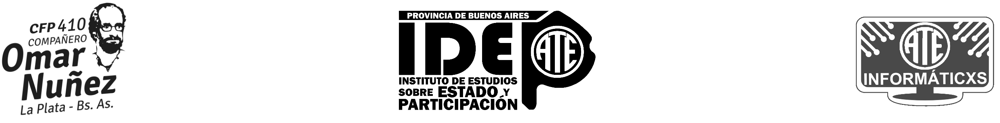

# Laboratorio 3

En este laboratorio veremos el trabajo colaborativo que puede darse en el mundo del software Libre. Cuando un tercero no tiene acceso de escritura a nuestro repositorio, la forma de colaborar son escribiendo `issues` para reportar errores, solicitar características, etc. o también aportando código.

## Trabajos prácticos entregados

Estos son los trabajos prácticos entregados por lxs alumnxs con sus respectivos repositorios. 

| Alumnx  | Descripción                            | URL                                                              |
|---------|----------------------------------------|------------------------------------------------------------------|
| Agata   | Juego plataforma (arcade)              | [Github repo](https://github.com/agtha-rmz/druids_challenge)     |
| Agustin | Juego estratégico-laberíntico (pygame) | [Github repo](https://github.com/Saume08/boomberman.git)         |
| Mauro   | Juego plataforma (pygame)              | [Github repo](https://github.com/MauroSei/JumpingBox)            |
| Marcelo | Juego plataforma (pygame)              | [Github repo](https://github.com/Argchacal/Primer-proyecto.git ) |
| Mariela | Juego piedra, papel, tijeras (tk)      | [Github repo](https://github.com/marielariela/piedrapapel)       |
| Marcos  | Calculadora (tk)                       | [Github repo](https://github.com/MarcosServin/TP4)               |

- Elija el programa de algún compañero o compañera.
- Ejecute el programa
- Estudie el código.

### Tiene dos opciones de colaborar
- Reportando errores o mejoras posibles mediante los `issues`.
- Aportando las soluciones mediante `pull-request`

#### Reportando errores:
- Vaya a la opción de `issues` del programa y reporte algún error que tenga el programa. Detallando en qué momento se produce y cómo el desarrollador puede replicar ese error. Aporte capturas de pantallas si lo ve necesario.

#### Aportando código
- Revise los issues por si tiene algún bug o algo para mejorar.
- Haga un `fork` del programa. Un fork, es una copia del repositorio en un momento determinado y lo copiará a su usuario. Ahora tendrá una copia del programa en su cuenta de Github para realizar cambios.
- Clone el repositorio del fork que acaba de hacer en su PC.
- Realice alguna mejora en el programa como la corrección de algún error (bug), y/o corrija el error documentado en los issues (si es que existe).
- Haga los commits necesarios y el `push`. Esto subirá las correcciones pero en su copia. Hay que avisarle al desarrollador original que usted ha mejorado el programa.
- Realice un `pull-request` (PR) desde Github para que el propietario original del programa reciba las mejoras sugeridas. Quedará en decisión del propietario aprobar o no el PR.

¡Muchas gracias por asistir! XD

-----

