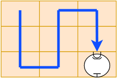

# Práctica 1 - Ejercicios resueltos

> Ejercicios resueltos en clase.


## Ejercicio 2 

Escribir un algoritmo que solo limpie la segunda fila y vuelva a la posición original.


```
programa ej_2
  imprimir ("Iniciar programa")
  girar_a_la_derecha
  avanzar
  girar_a_la_izquierda
  
  repetir (2 veces)
	limpiar
	avanzar
  
  limpiar
  imprimir ("Iniciando la vuelta")
  girar_a_izquierda
  avanzar
  girar_a_izquierda

  repetir (2 veces)
    avanzar
  
  imprimir ("Finalizo")
  repetir (2 veces)
    girar_a_izquierda
```

## Ejercicio 4


Escribir un algoritmo que permita al robot realizar la limpieza con el siguiente recorrido.




```
programa ej_4
  imprimir ("Comienza recorrido")
  girar_derecha
  repetir (2 veces)
    limpiar
    avanzar
  girar_a_izquierda
  limpiar
  avanzar
  girar_a_izquierda
  repetir (2 veces)
    limpiar
    avanzar
  girar_a_derecha
  limpiar
  avanzar
  girar_a_derecha
  repetir (2 veces)
    limpiar
    avanzar
  limpiar
  imprimir ("FInalizó la limpieza")
fin programa
```

## Ejercicio 7

Escriba un algoritmo que permita al robot limpiar un área de `40x40`, pero solamente limpie los lugares que es necesario, consultando a su sensor con la instrucción `esta_limpio`. Si el la posición donde se encuentra está limpia debe avanzar a la siguiente sin realizar la limpieza.

- :bulb: Puede ser útil utilizar <a href="https://programacion.concristian.com.ar/clase1.html#/condicionales_negativas" target="_blank">condiciones negativas</a>


```
programa ej_7
   imprimir("Iniciar limpieza")
   girar_a_derecha
   repetir (20 veces)
	repetir (39 veces)
		si NO (esta_limpio)
			limpiar
		avanzar
	si NO (esta_limpio)
		limpiar
	girar_a_izquierda
	avanzar
	girar_a_izquierda
	repetir (39 veces)
		si NO (esta_limpio)
			limpiar	
		avanzar
	girar_a_derecha
	
	si NO (esta_limpio)
		limpiar
	si NO (hay_pared)
		avanzar
		girar_a_derecha
	
   imprimir ("FIN!")
```