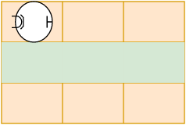

## Práctica 1 - Ejercicios resueltos

### Ejercicio 2 

Escribir un algoritmo que solo limpie la segunda fila y vuelva a la posición original.



```
programa ej_2
  imprimir ("Iniciar programa")
  girar_a_la_derecha
  avanzar
  girar_a_la_izquierda
  
  repetir (2 veces)
	limpiar
	avanzar
  
  limpiar
  imprimir ("Iniciando la vuelta")
  girar_a_izquierda
  avanzar
  girar_a_izquierda

  repetir (2 veces)
    avanzar
  
  imprimir ("Finalizo")
  repetir (2 veces)
    girar_a_izquierda
```
