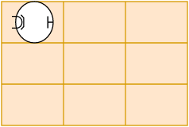
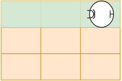
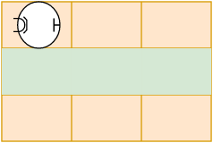
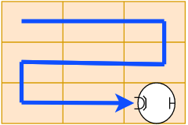
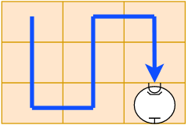
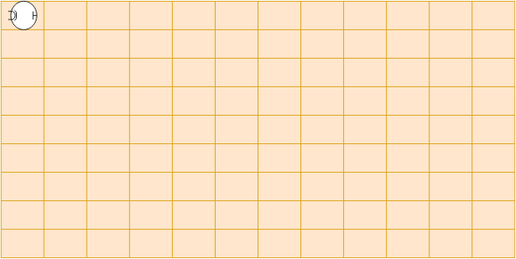
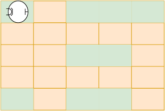
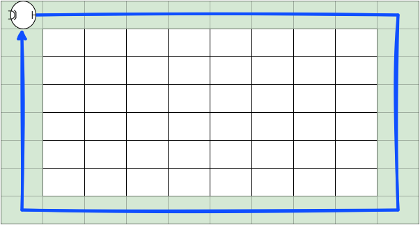

# Práctica 1 - Algoritmos y pseudocódigo - Parte I

> Esta práctica tiene como objetivo guiar al alumnx en los conceptos teóricos de algoritmos.

Para la realización de esta práctica, imaginemos que estamos escribiendo el software de un robot-aspiradora que debe limpiar un área. Imaginemos un área compuesto por *filas* (horizontales) y *columnas* (verticales). A cada cuadrante llamaremos *baldosas*.

##### Las instrucciones que entiende el robot son las siguientes:

- `avanzar`: Avanza un lugar hacia adelante.
- `girar_a_derecha:` Gira 90º hacia su derecha.
- `girar_a_izquierda:` Gira 90º hacia su izquierda.
- `limpiar`: Limpia el lugar donde se encuentra posicionado.
- `hay_pared_delante`: El robot consulta a su sensor si hay una pared delante. (`verdadero`/`falso`).
- `imprimir("Mensaje")`: Informará un mensaje cualquiera.
- `esta_limpio`: El robot consulta a su sensor si el lugar donde se encuentra ubicado está limpio (`verdadero`/`falso`)


#### Convenciones a utilizar:

- El área a limpiar (a menos que se indique lo contrario) será de `3x3`, como lo muestra la siguiente imágen.



- Un programa comienza con `programa <nombre_programa>` y finaliza con `fin programa`.

- Una **condición** debe poder evaluarse como `verdadera/falsa`.

- Para la estructura de control de [**selección**](https://programacion.concristian.com.ar/clase1.html#/est_control_seleccion) se usarán las palabras claves `si(condicion)` y `sino`. También es posible usar <a href="https://programacion.concristian.com.ar/clase1.html#/condicionales_negativas" target="_blank">condicionales negativas</a>, por ejemplo `si NO(condicion)`.

- Para la estructura de control de [**repetición**](https://programacion.concristian.com.ar/clase1.html#/est_control_repeticion) se usará la palabra clave `repetir(X veces)`. `X` es la cantidad de veces que se repetirá. Por ejemplo: `repetir (3 veces)`.

- Para la estructura de control de [**iteración**](https://programacion.concristian.com.ar/clase1.html#/est_control_iteracion) se usará la palabra clave `mientras(condicion)`. También es posible usar <a href="https://programacion.concristian.com.ar/clase1.html#/condicionales_negativas" target="_blank">condicionales negativas</a>, por ejemplo `mientras NO(condicion)`.

- Para informar algo, usaremos la palabra clave `imprimir` y entre paréntesis y comillas el mensaje que queramos informar, por ejemplo `imprimir("Mensaje a informar")`.
- El robot siempre se encuentra posicionado en la primer ubicación mirando hacia la derecha.

## Ejercicio 1

Escriba un algoritmo que permita limpiar toda la primer fila. 

```
programa ejercicio_1

    imprimir("Se iniciará la limpieza de la primer fila")

    repetir (2 veces)
        limpiar
        avanzar
    limpiar

    imprimir("Finalizó la limpieza requerida.")

fin programa
```

Al finalizar el programa, el estado debería ser el siguiente:



## Ejercicio 2 

Escribir un algoritmo que solo limpie la segunda fila y vuelva a la posición original.



:page_facing_up: [Ejercicio resuelto](https://github.com/kity-linuxero/practicas_23/blob/main/practicas/ej_resueltos/Pr1.md#ejercicio-2)

## Ejercicio 3

Escribir un algoritmo que permita al robot realizar la limpieza con el siguiente recorrido.



## Ejercicio 4

Escribir un algoritmo que permita al robot realizar la limpieza con el siguiente recorrido.



:page_facing_up: [Ejercicio resuelto](https://github.com/kity-linuxero/practicas_23/blob/main/practicas/ej_resueltos/Pr1.md#ejercicio-4)

## Ejercicio 5

Escribir un algoritmo que permita al robot limpiar completamente un área de `40x40` usando el recorrido del ejercicio 3.

_La imágen es ilustrativa_.



## Ejercicio 6

Escribir un algoritmo que permita al robot limpiar completamente un área de `40x40` usando el recorrido del ejercicio 4.

## Ejercicio 7

Escriba un algoritmo que permita al robot limpiar un área de `40x40`, pero solamente limpie los lugares que es necesario, consultando a su sensor con la instrucción `esta_limpio`. Si el la posición donde se encuentra está limpia debe avanzar a la siguiente sin realizar la limpieza.

- :bulb: Puede ser útil utilizar <a href="https://programacion.concristian.com.ar/clase1.html#/condicionales_negativas" target="_blank">condiciones negativas</a>



:page_facing_up: [Ejercicio resuelto](https://github.com/kity-linuxero/practicas_23/blob/main/practicas/ej_resueltos/Pr1.md#ejercicio-7)


## Ejercicio 8

>A partir de los siguientes ejercicios, **las baldosas pueden requerir mas de una limpieza** para que quede completamente limpias.

Escriba un algoritmo que permita recorrer las primeras 5 filas limpiando completamente todas las baldosas de las filas. El área es de `40x40`.

:page_facing_up: [Ejercicio resuelto](https://github.com/kity-linuxero/practicas_23/blob/main/practicas/ej_resueltos/Pr1.md#ejercicio-8)

## Ejercicio 9

Escriba un algoritmo que permita recorrer al robot la fila 17 limpiando completamente solo las baldosas de columnas impares. Como se desconoce el área a limpiar, el recorrido termina cuando tenga enfrente una pared.

:page_facing_up: [Ejercicio resuelto](https://github.com/kity-linuxero/practicas_23/blob/main/practicas/ej_resueltos/Pr1.md#ejercicio-9)

## Ejercicio 10

Escriba un algoritmo que recorra la quinta fila pero limpiando completamente solo las columnas pares que sean necesarias limpiar. Como se desconoce el área a limpiar, el recorrido termina cuando tenga enfrente una pared.

## Ejercicio 11

Escriba un algoritmo que permita al robot recorrer el perímetro del área de la que se desconoce el tamaño realizando la limpieza completamente.



:page_facing_up: [Ejercicio resuelto](https://github.com/kity-linuxero/practicas_23/blob/main/practicas/ej_resueltos/Pr1.md#ejercicio-11)


# Ejercicios adicionales

Para los siguientes ejercicios tenga en cuenta que:
- Las baldosas pueden no quedar completamente limpiar con una sola pasada.
- El área es de `40x40`.
- `bateria_baja`: El robot consulta a su sensor si queda poca energía. (`verdadero`/`falso`).
- `pos(X,Y)`: Posiciona al robot en una ubicación señalada por X e Y. Por ejemplo:
    - `pos(4,5)`: Ubicará al robot en la posición fila: 4, columna 5.
    - `pos(1,1)`: Ubica al robot en la ubicación inicial.
    - `pos(40,40)`: Ubica al robot en la última baldosa.
    
     _Cuando se realiza una instrucción de posicionamiento `pos(X,Y)`, el robot se dirigirá a la ubicación deseada y durante el recorrido, **no** hace otra cosa que solo moverse (no puede limpiar ni consultar sus sensores)._

## Ejercicio 12

Escriba un programa que permita al robot limpiar la ubicación `(4,38)`. Si la ubicación requería limpieza debe informar _"Se realizó la limpieza"_. Si no requería limpieza, debe informar _"No fue necesaria la limpieza."_

:page_facing_up: [Ejercicio resuelto](https://github.com/kity-linuxero/practicas_23/blob/main/practicas/ej_resueltos/Pr1.md#ejercicio-12)

## Ejercicio 13
Escriba un programa que permita al robot recorrer limpiando las baldosas en fila `30` desde la columna `8` hasta la columna `23`.
Para ahorrar energía, no limpia si la baldosa se encuentra limpia.

:page_facing_up: [Ejercicio resuelto](https://github.com/kity-linuxero/practicas_23/blob/main/practicas/ej_resueltos/Pr1.md#ejercicio-13)

## Ejercicio 14
Escriba un programa que permita al robot recorrer la columna `23` limpiando las baldosas a su paso hasta que queden limpias. Si en algún momento se queda con poca batería, debe seguir recorriendo la columna pero sin limpiar.

:page_facing_up: [Ejercicio resuelto](https://github.com/kity-linuxero/practicas_23/blob/main/practicas/ej_resueltos/Pr1.md#ejercicio-14)

## Ejercicio 15
Escriba un programa que recorra la fila `39` buscando una baldosa que falta limpiar que seguro existe.
Una vez que la encuentre debe limpiarla e informar que se ha limpiado.

## Ejercicio 16
Escriba un programa que permita al robot limpiar la baldosa `(40,40)` hasta que se quede con batería baja. Cuando eso ocurra debe dirigirse a la posición `(1,1)`.

## Ejercicio 17

Escriba un programa que permita recorrer el perímetro del área de `40x40` limpiando cada baldosa a su paso hasta que se quede con poca batería. Cuando se quede con poca batería, debe interrumpir inmediatamente la limpieza y dirigirse a la posición `(1,1)`.

:page_facing_up: [Ejercicio resuelto](https://github.com/kity-linuxero/practicas_23/blob/main/practicas/ej_resueltos/Pr2.md#ejercicio-17)

## Ejercicio 18 (extra)
Escriba un programa que recorra toda la primer fila verificando que está limpia.
Si encuentra una baldosa sucia debe informar _"El piso necesita limpiarse"_ y terminar el recorrido. Si termina el recorrido y no encuentra ninguna baldosa sucia debe informar _"Se encuentra todo limpio"_

Pista:
- Para este ejercicio puede ser útil usar dos condiciones juntas en una instrucción. Por ejemplo
```
si (cond1 Y cond2) 
    hacer algo
```
En ese caso, la instrucción `si` evaluará que **se cumplan ambas condiciones** para entrar en su bloque de instrucciones.

Puede usar también negativas, por ejemplo

```
si (cond1 Y NO cond2)
    hacer algo
```

```
si (NO cond1 y NO cond2)
    hacer algo
```

:page_facing_up: [Ejercicio resuelto](https://github.com/kity-linuxero/practicas_23/blob/main/practicas/ej_resueltos/Pr2.md#ejercicio-18)


##### Programación 2023 - Centro de Formación Profesional 410 La Plata - Compañero Omar Núñez


-----


